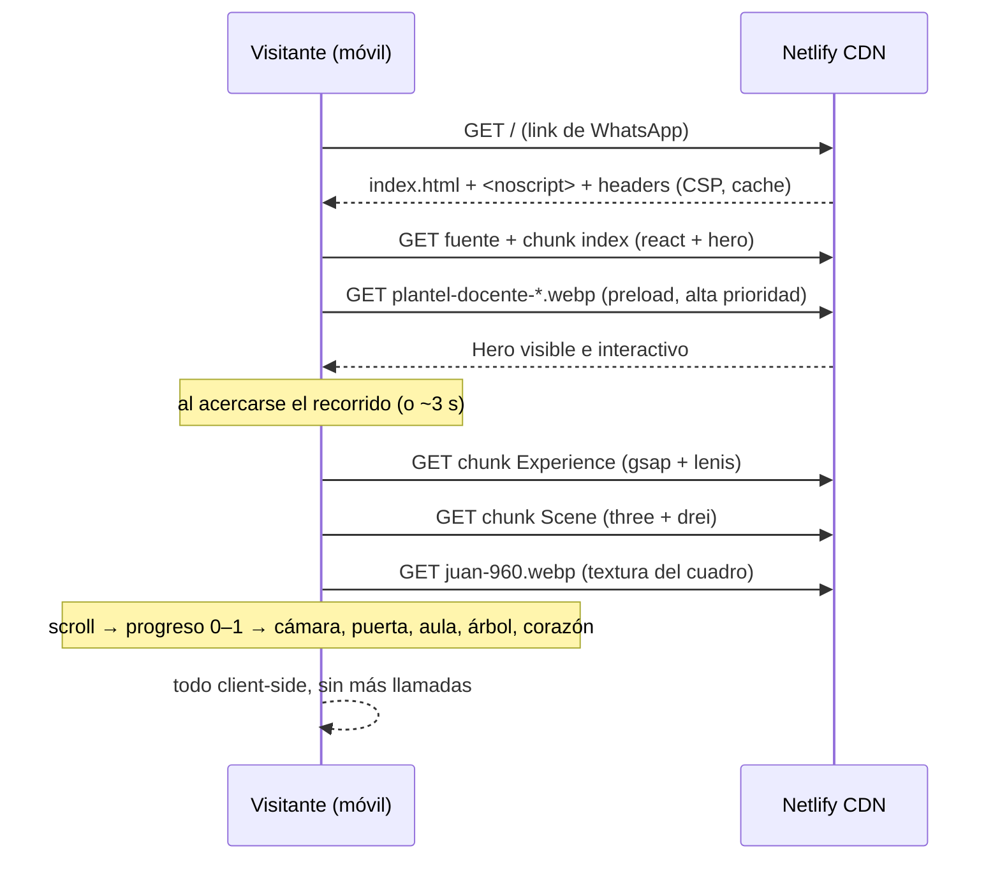

# Flujo: Recorrido "La Escuela Mágica" (Día del Maestro)

## Objetivo

Que un docente que abre el link (normalmente desde WhatsApp, en el celular)
viva una experiencia 3D emocional controlada por el scroll —del hero a un
corazón hecho de huellas— que se sienta premium y hecha con cariño, sin
sacrificar velocidad ni soportar mal 100+ accesos simultáneos.

## Actores

- **Visitante:** docente o familia del Instituto Armonía.
- **Sistema:** sitio estático servido desde CDN (Netlify). Sin backend. Todo el
  render 3D es client-side.

## Pre-condiciones

- El sitio está desplegado y el link se compartió.
- Las familias autorizaron el uso de imagen de los alumnos.

## Pasos principales (happy path)

1. El visitante toca el link. Se descarga `index.html` + fuente + chunk `index`
   (react + hero, ~64 kB gz). **El hero se pinta enseguida** con su foto original
   del plantel (no se reemplaza nunca).
2. Al acercarse el recorrido al viewport (o tras ~3 s), se cargan en diferido el
   chunk `Experience` (gsap + lenis) y el chunk `Scene` (three/drei/postprocessing).
3. Se detecta el *tier* de calidad:
   - `static`: reduced-motion, sin WebGL, o gama muy baja → **fallback** (ver abajo).
   - `low` (mobile / gama media): DPR ≤ 1.5, sin postprocessing, sin sombras,
     menos partículas, menos hojas, cámara más retrasada.
   - `high` (desktop): bloom + viñeta sutiles, sombras, más densidad.
4. El lienzo se **fija (pin)** y el scroll pasa a controlar un único progreso 0–1
   (GSAP ScrollTrigger + Lenis). Ese progreso mueve **todo**: cámara, puerta,
   luces, objetos, textos, transformación, árbol y corazón.
5. Beats del recorrido (progreso aproximado):

   | Progreso | Qué pasa | Texto |
   |---|---|---|
   | 0.00–0.12 | Escuela flotante lejana, nubes, estrellas | "¡Feliz Día del Maestro!" · "Hay lugares donde se aprende…" |
   | 0.13–0.29 | La cámara se acerca a la puerta | "…y lugares donde también se aprende a crecer." |
   | 0.22–0.34 | La puerta se abre: luz cálida + partículas | — |
   | 0.34–0.46 | La cámara entra al aula | — |
   | 0.42–0.56 | Libros se abren, lápices flotan, luz se enciende, dibujos, foto de **juan** | "Queremos agradecerles de corazón…" |
   | 0.52–0.67 | Nombres de los 8 chicos integrados (dibujos + estrellas) | "Gracias por acompañar a nuestros hijos e hijas…" |
   | 0.66–0.78 | Docentes: **Camila**, **Matilda** + tiza en el pizarrón (**Jony, Mica, Mica, Yani, Vicky**) | "Enseñar no es solamente transmitir conocimientos…" → "…también es dejar huellas." |
   | 0.76–0.86 | Los objetos salen de la escuela; la cámara se aleja; la escuela queda chica | — |
   | 0.83–0.95 | Aparece el árbol; raíces = amor, paciencia, aprendizaje, confianza, alegría, acompañamiento; las hojas se encienden de a una | "Una escuela no se construye solamente con paredes." |
   | 0.90–1.00 | El árbol forma un **corazón** | "Se construye con las huellas que ustedes dejan en cada niño." · "❤️ Gracias por dejar huellas." · "INSTITUTO ARMONÍA · ¡Feliz Día del Maestro! 🍎✨" |

6. Pasado el pin, el scroll continúa hasta el pie del sitio. El botón flotante
   "volver arriba" permite reiniciar el recorrido.

## Caminos alternativos

- **reduced-motion / sin WebGL / gama muy baja:** no se monta el canvas. Se
  renderiza `StaticExperience`: la misma narrativa completa en paneles que se
  scrollean normal, con la foto de juan y todos los nombres. Todo el contenido
  importante es visible sin depender de ninguna animación.
- **Lector de pantalla / sin JS:** además del recorrido hay un bloque `.sr-only`
  con la narrativa en orden + los 8 chicos + las docentes (las dos "Mica"
  incluidas) + las palabras-raíz. `index.html` trae un `<noscript>` con el
  mensaje esencial.
- **El chunk 3D tarda en bajar:** se ve un póster ("Preparando la escuela
  mágica…") con degradé cálido; nunca una pantalla rota.
- **Resize / rotación:** `ScrollTrigger.refresh()` recalcula el pin.

## Errores esperados

| Situación | Comportamiento |
|---|---|
| WebGL falla al crear el contexto | tier `static` (fallback) |
| `juan-960.webp` 404 | el marco queda sin textura (plano claro), el recorrido sigue |
| Fuente de Google no carga | fallback a serif/system |
| FPS bajo sostenido | `PerformanceMonitor` + `AdaptiveDpr` bajan el DPR |

## Diagrama

## Datos involucrados

- **Entradas:** ninguna (sin formularios ni parámetros).
- **Salidas / persistencia / analítica:** ninguna. Sin cookies ni localStorage.
- **Contenido:** hero en `src/data/content.ts`; guion completo, nombres y
  palabras-raíz en `src/experience/data.ts`; foto del hero en `src/data/gallery.ts`
  + `public/gallery/`; foto individual en `public/gallery/juan-960.webp`.
